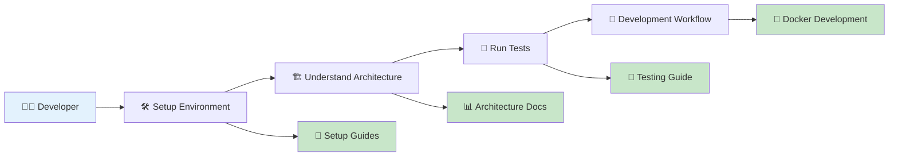
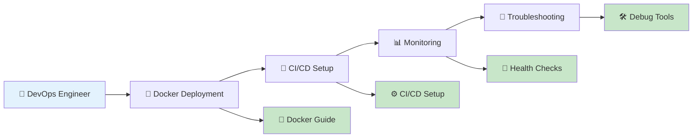
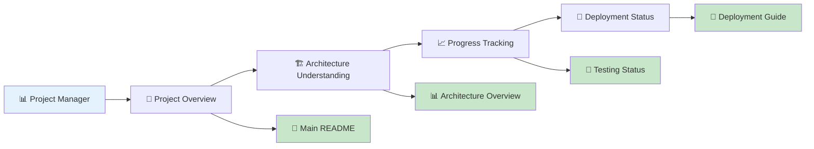
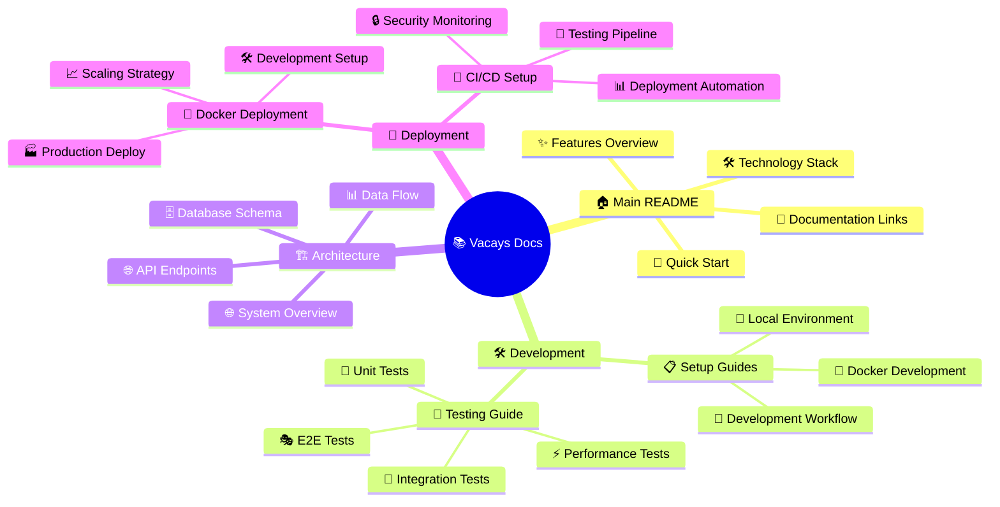

# 📚 Vacays Documentation Hub

**Comprehensive documentation for the Vacays hotel booking platform**

---

## 🚀 Quick Start

> **New to the project?** Follow this path:

| Step | Guide | Time | Description |
|:----:|-------|:----:|-------------|
| **1** | [🛠️ Development Setup](setup-guides.md) | 10 min | Local development environment |
| **2** | [🏗️ Architecture Overview](architecture.md) | 5 min | Understand system design |
| **3** | [🐳 Docker Deployment](docker-deployment.md) | 5 min | Deploy with containers |

---

## 📖 Documentation Guide

### 🛠️ Development & Setup

| 📋 Document | 📝 Description | 👥 Best For |
|-------------|----------------|-------------|
| **[🛠️ Development Setup](setup-guides.md)** | Local development environment setup | New developers |
| **[🏗️ Architecture](architecture.md)** | System design and component overview | Understanding codebase |
| **[🧪 Testing Guide](testing.md)** | Comprehensive testing documentation | Quality assurance |
| **[🐳 Docker Deployment](docker-deployment.md)** | Complete containerized deployment | All deployment scenarios |
| **[🚀 CI/CD Setup](ci-cd-setup.md)** | Automated deployment pipelines | DevOps engineers |

### 🎯 Quick Access

| 📋 Resource | 📝 Description | 🔗 Access |
|-------------|----------------|-----------|
| **[📊 API Documentation](http://localhost:7000/api-docs)** | Interactive Swagger API docs | Local/Production |
| **[🔧 Environment Setup](docker-deployment.md#-environment-configuration)** | Configuration reference | Documentation |
| **[🛠️ Troubleshooting](docker-deployment.md#️-troubleshooting)** | Common issues and solutions | Documentation |

---

## 🎯 Role-Based Guides

### 👨‍💻 For Developers

**Getting Started Path:**
1. **📖 Understand the System**: [Architecture Overview](architecture.md)
2. **🛠️ Setup Environment**: [Development Setup](setup-guides.md)
3. **🧪 Quality Practices**: [Testing Guide](testing.md)
4. **🐳 Deploy Locally**: [Docker Deployment](docker-deployment.md)

### 🚀 For DevOps Engineers

**Deployment Path:**
1. **📋 Plan Deployment**: [Docker Deployment Guide](docker-deployment.md)
2. **🔧 Environment Setup**: [Environment Variables](docker-deployment.md#-environment-configuration)
3. **🚀 Automate**: [CI/CD Setup](ci-cd-setup.md)
4. **🛠️ Troubleshoot**: [Troubleshooting Guide](docker-deployment.md#️-troubleshooting)

### 📊 For Project Managers

**Project Overview Path:**
1. **📖 Project Summary**: [Main README](../README.md)
2. **🏗️ Technical Scope**: [Architecture](architecture.md)
3. **🧪 Quality Processes**: [Testing Guide](testing.md)

---

## 🌐 External Resources

| 🛠️ Service | 📝 Purpose | 💰 Cost | 🔗 Setup Guide |
|-------------|------------|---------|----------------|
| **MongoDB Atlas** | Database hosting | Free tier | [Environment Setup](docker-deployment.md#-environment-configuration) |
| **Railway** | Docker hosting | $5 credit/month | [Docker Deployment](docker-deployment.md) |
| **Render** | Docker hosting | Free tier | [Docker Deployment](docker-deployment.md) |

---

## 🆘 Need Help?

| 🚨 Problem Type | 📖 Solution | ⏱️ Time |
|-----------------|-------------|---------|
| **🛠️ Setup Issues** | [Development Setup](setup-guides.md#-troubleshooting) | 5 min |
| **🐳 Deployment Problems** | [Docker Troubleshooting](docker-deployment.md#️-troubleshooting) | 10 min |
| **🧪 Testing Problems** | [Testing Guide](testing.md) | 5 min |
| **🏗️ Architecture Questions** | [Architecture Guide](architecture.md) | 5 min |

### 📞 Getting Support

1. **🔍 Search Documentation**: Use `Ctrl+F` to search within documents
2. **📋 Check Issues**: [GitHub Issues](https://github.com/himuexe/Hotel-Booking-Website/issues)
3. **🆕 Create Issue**: [Report a problem](https://github.com/himuexe/Hotel-Booking-Website/issues/new)

---

## 📊 Documentation Status

| 📄 Document | ✅ Status | 📊 Completeness |
|-------------|-----------|-----------------|
| [🛠️ Development Setup](setup-guides.md) | ✅ Complete | 100% |
| [🏗️ Architecture](architecture.md) | ✅ Complete | 100% |
| [🧪 Testing Guide](testing.md) | ✅ Complete | 100% |
| [🐳 Docker Deployment](docker-deployment.md) | ✅ Complete | 100% |
| [🚀 CI/CD Setup](ci-cd-setup.md) | ✅ Complete | 100% |

---

## 📚 Complete Documentation Map

### 🗺️ Documentation Structure

**📚 Well-organized documentation enables faster development!**

[🔝 Back to Top](#-vacays-documentation-hub)

 