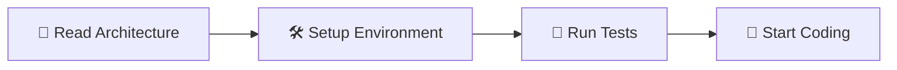
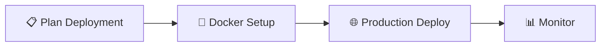

# 📚 Vacays Documentation Hub

**Comprehensive documentation for the Vacays hotel booking platform**

---

## 🚀 Quick Start

> **New to the project?** Follow this path to get up and running quickly:

| Step | Guide | Time | Description |
|:----:|-------|:----:|-------------|
| **1** | [🛠️ Setup Guide](setup-guides.md) | 10 min | Get your development environment running |
| **2** | [🏗️ Architecture](architecture.md) | 5 min | Understand the system design |
| **3** | [🐳 Docker Deployment](docker-deployment.md) | 2 min | Deploy with one command |

---

## 📖 Documentation Categories

### 🛠️ Development & Setup

| 📋 Document | 📝 Description | 👥 Best For | ⏱️ Time |
|-------------|----------------|-------------|---------|
| **[🛠️ Setup Guides](setup-guides.md)** | Local development setup instructions | New developers | 10 min |
| **[🏗️ Architecture](architecture.md)** | System design and component overview | Understanding codebase | 5 min |
| **[🧪 Testing Guide](testing.md)** | Comprehensive testing documentation | Quality assurance | 15 min |

### 🚀 Deployment & Operations

| 📋 Document | 📝 Description | 👥 Best For | 💰 Cost |
|-------------|----------------|-------------|---------|
| **[🐳 Docker Deployment](docker-deployment.md)** | Complete Docker deployment guide | All deployment scenarios | Free |

### 🔧 Technical References

| 📋 Resource | 📝 Description | 🔗 Access |
|-------------|----------------|-----------|
| **[📊 API Documentation](http://localhost:7000/api-docs)** | Interactive Swagger API docs | Local/Production |
| **[🔧 Environment Setup](docker-deployment.md#-environment-configuration)** | Configuration reference | Documentation |
| **[🛠️ Troubleshooting](docker-deployment.md#️-troubleshooting)** | Common issues and solutions | Documentation |

---

## 🎯 Use Case Guides

### 👨‍💻 For Developers

> **Getting Started Path:**

1. **📖 Understand the System**: Read [Architecture Overview](architecture.md)
2. **🛠️ Setup Environment**: Follow [Setup Guides](setup-guides.md)
3. **🧪 Quality Practices**: Review [Testing Guide](testing.md)
4. **🐳 Deploy Locally**: Use [Docker Deployment](docker-deployment.md)

### 🚀 For DevOps Engineers

> **Deployment Path:**

1. **📋 Plan Deployment**: Review [Docker Deployment Guide](docker-deployment.md)
2. **🔧 Environment Setup**: Configure [Environment Variables](docker-deployment.md#-environment-configuration)
3. **🚀 Deploy**: Follow [Production Deployment](docker-deployment.md#-production-deployment)
4. **🛠️ Troubleshoot**: Use [Troubleshooting Guide](docker-deployment.md#️-troubleshooting)

### 📊 For Project Managers

> **Project Overview Path:**

1. **📖 Project Summary**: Start with main [README](../README.md)
2. **🏗️ Technical Scope**: Review [Architecture](architecture.md)
3. **🧪 Quality Processes**: Check [Testing Guide](testing.md)
4. **💰 Deployment Costs**: See [Free Hosting Options](docker-deployment.md#-free-hosting-options)

---

## 🔗 Cross-References

### 📚 Related Documentation

| 📄 Document | 📝 Description | 🔗 Link |
|-------------|----------------|---------|
| **Main README** | Project overview and quick start | [../README.md](../README.md) |
| **License** | MIT License details | [../LICENSE](../LICENSE) |

### 🌐 External Resources

| 🛠️ Service | 📝 Purpose | 💰 Cost | 🔗 Setup Guide |
|-------------|------------|---------|----------------|
| **MongoDB Atlas** | Free Database | $0/month | [Environment Setup](docker-deployment.md#-environment-configuration) |
| **Railway** | Docker Hosting | $5 credit/month | [Free Hosting](docker-deployment.md#-option-a-railway-recommended) |
| **Render** | Docker Hosting | Free tier | [Free Hosting](docker-deployment.md#-option-b-render) |
| **DigitalOcean** | VPS Hosting | $4/month | [Free Hosting](docker-deployment.md#-option-c-digitalocean-app-platform) |

---

## 📊 Documentation Status

| 📄 Document | ✅ Status | 📅 Updated | 📊 Completeness | 🎯 Focus |
|-------------|-----------|------------|-----------------|----------|
| [🛠️ Setup Guides](setup-guides.md) | ✅ Complete | Current | 100% | Development |
| [🏗️ Architecture](architecture.md) | ✅ Complete | Current | 100% | System Design |
| [🧪 Testing Guide](testing.md) | ✅ Complete | Current | 100% | Quality |
| [🐳 Docker Deployment](docker-deployment.md) | ✅ Complete | Current | 100% | Deployment |

---

## 🆘 Need Help?

### 🔍 Quick Solutions

| 🚨 Problem Type | 📖 Solution | ⏱️ Time |
|-----------------|-------------|---------|
| **🛠️ Setup Issues** | [Setup Troubleshooting](setup-guides.md) | 5 min |
| **🐳 Deployment Problems** | [Docker Troubleshooting](docker-deployment.md#️-troubleshooting) | 10 min |
| **🧪 Testing Problems** | [Testing Issues](testing.md) | 5 min |
| **🏗️ Architecture Questions** | [Architecture Guide](architecture.md) | 5 min |

### 📞 Getting Support

> **Follow this escalation path:**

1. **🔍 Search Documentation**: Use `Ctrl+F` to search within documents
2. **📋 Check Issues**: Review [GitHub Issues](https://github.com/himuexe/Hotel-Booking-Website/issues)
3. **🆕 Create Issue**: [Report a problem](https://github.com/himuexe/Hotel-Booking-Website/issues/new)
4. **💬 Community**: Join discussions in the repository

---

## 🔄 Documentation Updates

> **This documentation is actively maintained and follows our consolidation strategy**

### 📈 Recent Improvements

- ✅ **Consolidated Deployment Docs**: 3 files → 1 comprehensive Docker guide
- ✅ **Enhanced Visual Design**: Added emojis, badges, and tables
- ✅ **Docker-First Approach**: Focused on containerized deployment
- ✅ **Free Hosting Focus**: Removed paid service dependencies

### 🔔 Stay Updated

- 🔗 **Follow the Repository**: [Hotel-Booking-Website](https://github.com/himuexe/Hotel-Booking-Website)
- 📝 **Check Recent Commits**: Review documentation changes
- 🔔 **Enable Notifications**: Get updates on new releases

---

**📝 Documentation Feedback**

Can't find what you're looking for? Help us improve!

[🐛 Report Issue](https://github.com/himuexe/Hotel-Booking-Website/issues/new) • [💡 Suggest Improvement](https://github.com/himuexe/Hotel-Booking-Website/issues/new) • [⭐ Star the Project](https://github.com/himuexe/Hotel-Booking-Website)

[🔝 Back to Top](#-vacays-documentation-hub)

 