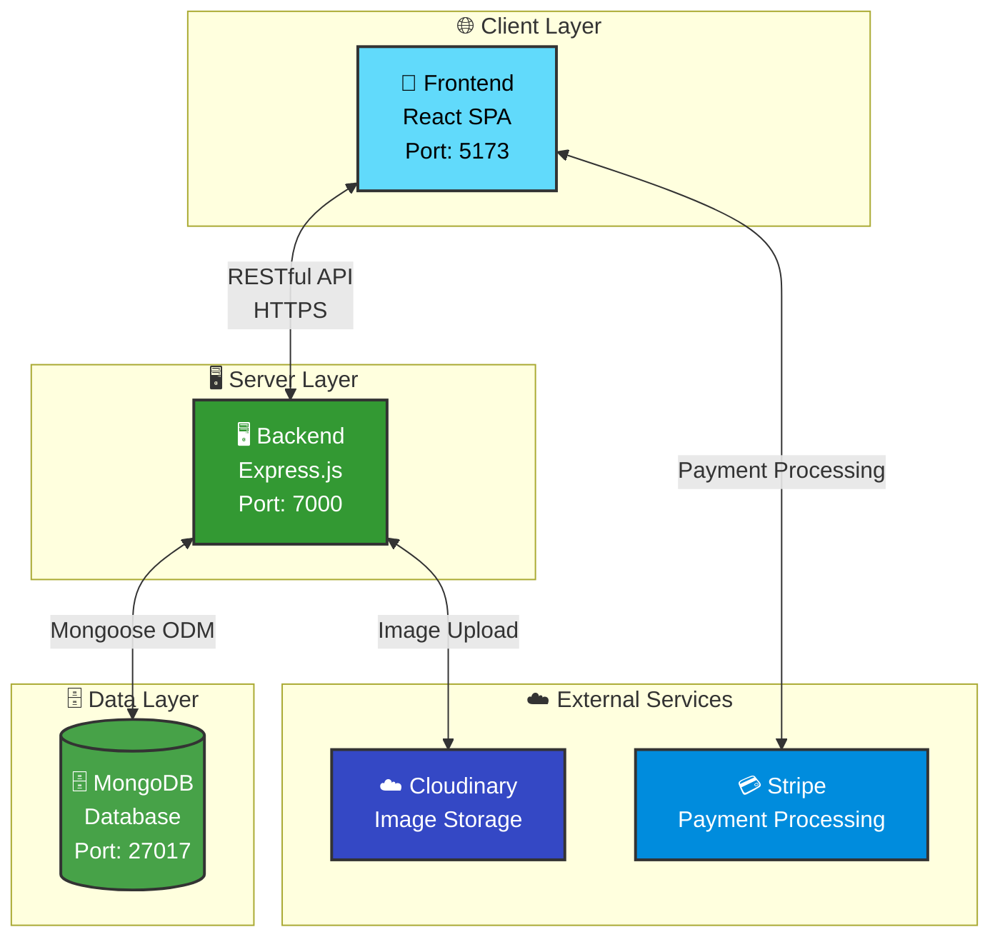
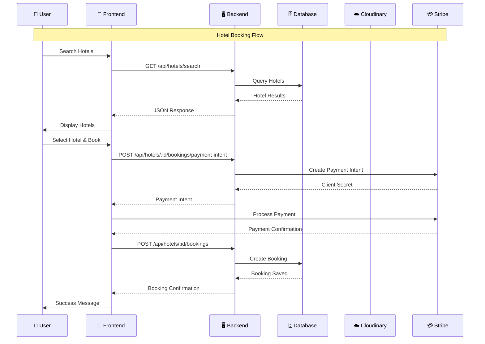
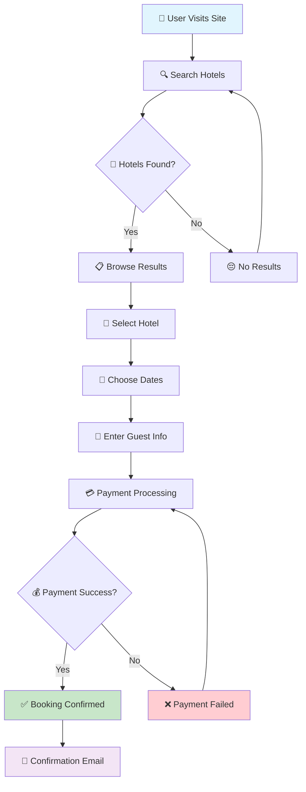
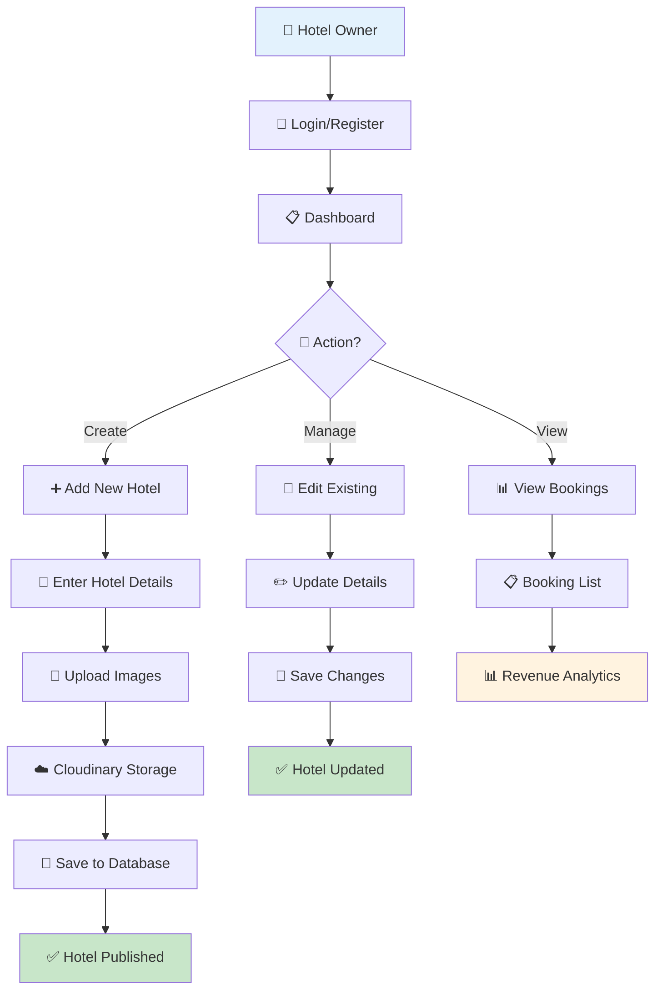
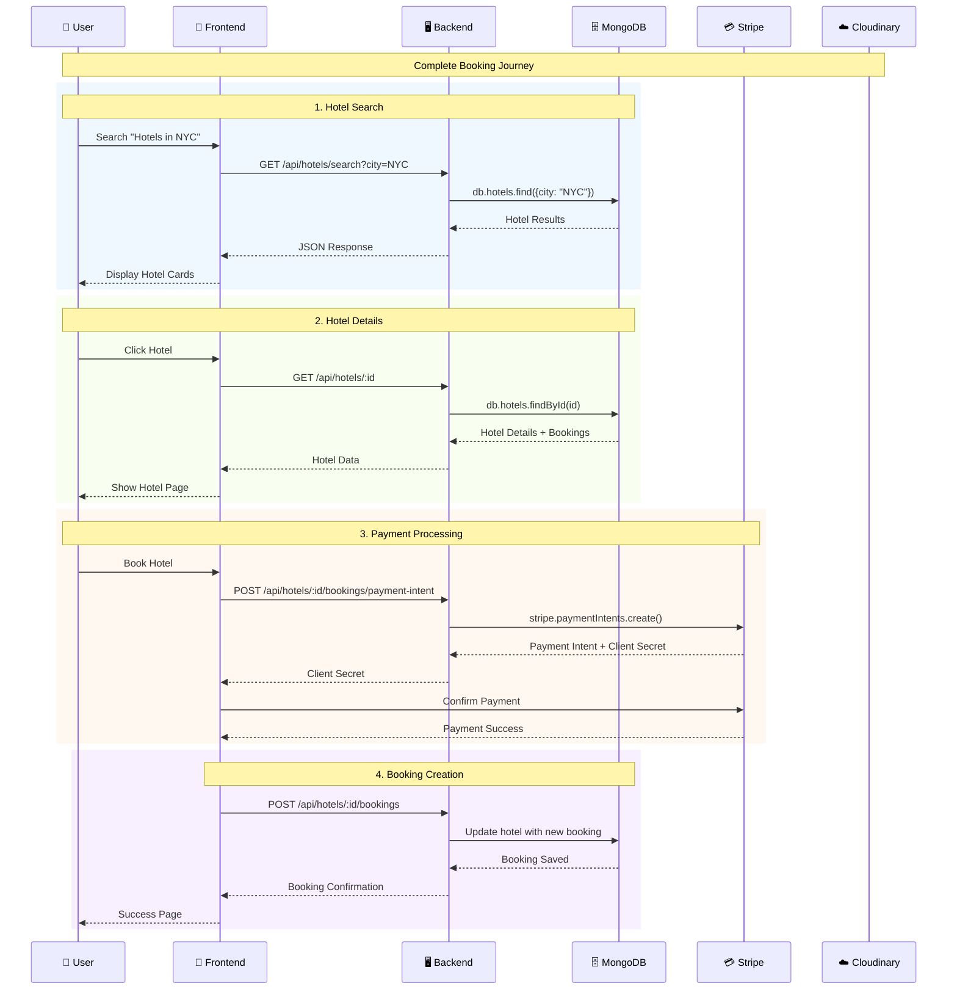
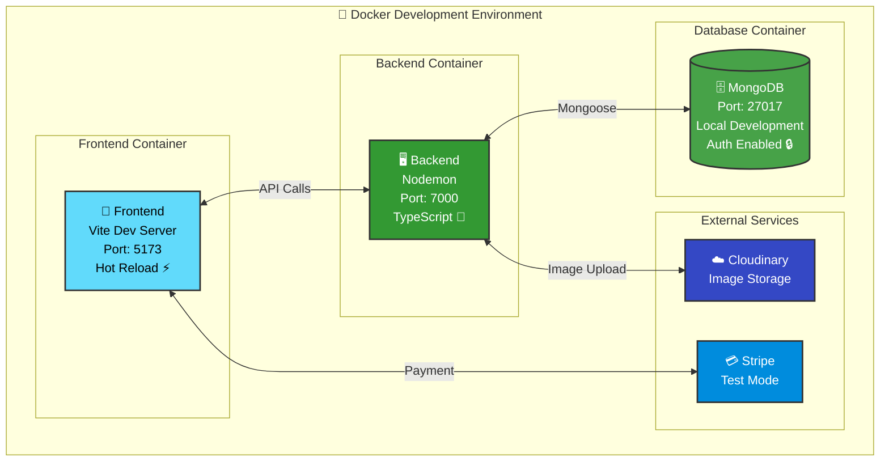
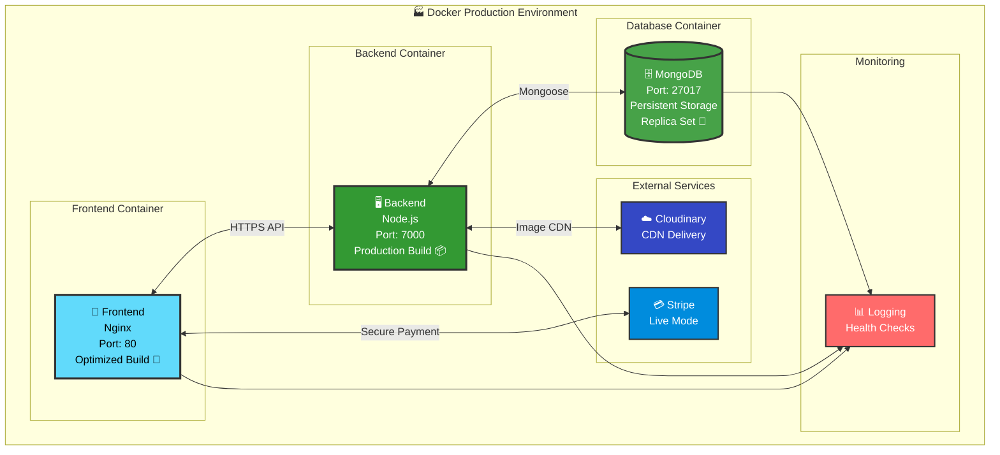
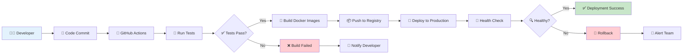

# 🏗️ Vacays Hotel Booking Website - Architecture Documentation

> **Comprehensive architecture overview of the Vacays Hotel Booking Platform**  
> MERN stack implementation with modern development practices and scalable design

<div align="center">

[](https://github.com/himuexe/Hotel-Booking-Website)
[](https://reactjs.org/)
[](https://nodejs.org/)
[](https://www.mongodb.com/)

</div>

---

## 📋 Table of Contents

1. [🎯 System Overview](#-system-overview)
2. [🏗️ Architecture Diagram](#️-architecture-diagram)
3. [🧩 Component Details](#-component-details)
4. [🗄️ Database Schema](#️-database-schema)
5. [🌐 API Endpoints](#-api-endpoints)
6. [📊 Data Flow](#-data-flow)
7. [🐳 Deployment Architecture](#-deployment-architecture)

---

## 🎯 System Overview

The Vacays App is a full-stack web application built using the **MERN stack** (MongoDB, Express.js, React, Node.js) with TypeScript. It follows a modern **client-server architecture** with clear separation of concerns:

<div align="center">

| Component | Technology | Purpose | Status |
|-----------|------------|---------|--------|
| **🎨 Frontend** | React 18 + TypeScript | Single-page application (SPA) | [](https://github.com/himuexe/Hotel-Booking-Website) |
| **🖥️ Backend** | Express.js + TypeScript | RESTful API server | [](https://github.com/himuexe/Hotel-Booking-Website) |
| **🗄️ Database** | MongoDB + Mongoose | NoSQL data storage | [](https://github.com/himuexe/Hotel-Booking-Website) |
| **☁️ External Services** | Cloudinary + Stripe | Image storage & payments | [](https://github.com/himuexe/Hotel-Booking-Website) |

</div>

### 🎯 Key Architectural Principles

- **🔄 Separation of Concerns**: Clear boundaries between frontend, backend, and data layers
- **📱 Responsive Design**: Mobile-first approach with progressive enhancement
- **🔒 Security First**: JWT authentication, input validation, and secure communication
- **⚡ Performance Optimized**: Efficient data fetching, caching, and bundle optimization
- **🧪 Testable**: Comprehensive testing strategy across all layers

---

## 🏗️ Architecture Diagram

### 🌐 System Overview



### 🔄 Communication Flow



---

## 🧩 Component Details

### 🎨 Frontend Architecture

<div align="center">

[](https://reactjs.org/)
[](https://www.typescriptlang.org/)
[](https://vitejs.dev/)
[](https://tailwindcss.com/)

</div>

#### 🏗️ Frontend Structure

```
frontend/src/
├── 📁 components/          # Reusable UI components
├── 📁 pages/              # Route-based page components
├── 📁 layouts/            # Layout components (Header, Footer)
├── 📁 forms/              # Complex form components
├── 📁 contexts/           # React Context providers
├── 📁 shared/             # Shared utilities and types
└── 📁 config/             # Configuration files
```

#### 🎯 Key Frontend Features

- **🔧 Build Tool**: Vite for fast development and optimized builds
- **🎨 Styling**: Tailwind CSS for utility-first styling
- **🔄 State Management**: React Query for server state, Context API for local state
- **🛣️ Routing**: React Router for client-side navigation
- **📝 Forms**: React Hook Form for efficient form handling

#### 📄 Key Pages & Components

| Page/Component | Purpose | Key Features |
|----------------|---------|--------------|
| **🏠 Home.tsx** | Landing page | Search functionality, hero section |
| **🔍 Search.tsx** | Hotel search results | Filtering, pagination, sorting |
| **🏨 Detail.tsx** | Hotel details | Image gallery, amenities, booking |
| **💳 Booking.tsx** | Booking & payment | Guest info, payment processing |
| **🔐 SignIn/Register.tsx** | Authentication | User login and registration |
| **🏨 MyHotels.tsx** | Hotel management | CRUD operations for hotel owners |
| **📋 MyBookings.tsx** | Booking history | User's past and upcoming bookings |

### 🖥️ Backend Architecture

<div align="center">

[](https://nodejs.org/)
[](https://expressjs.com/)
[](https://mongoosejs.com/)
[](https://jwt.io/)

</div>

#### 🏗️ Backend Structure

```
backend/src/
├── 📁 routes/             # API route handlers
├── 📁 models/             # Mongoose data models
├── 📁 middleware/         # Custom middleware functions
├── 📁 shared/             # Shared utilities and types
└── 📄 index.ts           # Application entry point
```

#### 🔒 Security & Authentication

- **🔐 JWT Authentication**: HTTP-only cookies for secure token storage
- **✅ Input Validation**: Express Validator for request validation
- **🛡️ Rate Limiting**: Protection against brute force attacks
- **🔒 CORS Configuration**: Secure cross-origin resource sharing

#### 🎯 API Design Principles

- **📋 RESTful Design**: Standard HTTP methods and status codes
- **📊 Consistent Response Format**: Uniform API response structure
- **🔍 Error Handling**: Comprehensive error handling and logging
- **📖 Documentation**: Swagger/OpenAPI documentation

---

## 🗄️ Database Schema

> **Database**: MongoDB with Mongoose ODM for schema validation and data modeling

### 👤 Users Collection

```typescript
{
  _id: ObjectId,
  email: string (unique),
  password: string (hashed),
  firstName: string,
  lastName: string
}
```

### 🏨 Hotels Collection (with Embedded Bookings)

```typescript
{
  _id: ObjectId,
  userId: string,                    // Hotel owner reference
  name: string,
  city: string,
  country: string,
  description: string,
  type: string,                      // Hotel category
  adultCount: number,
  childCount: number,
  facilities: string[],              // Amenities array
  pricePerNight: number,
  starRating: number (1-5),
  imageUrls: string[],               // Cloudinary URLs
  lastUpdated: Date,
  bookings: [                        // Embedded bookings
    {
      _id: ObjectId,
      userId: string,                // Guest reference
      firstName: string,
      lastName: string,
      email: string,
      adultCount: number,
      childCount: number,
      checkIn: Date,
      checkOut: Date,
      totalCost: number
    }
  ]
}
```

### 🎯 Schema Design Decisions

- **📦 Embedded Bookings**: Bookings are embedded within hotel documents for:
  - ⚡ **Performance**: Faster read operations for hotel details with bookings
  - 🔗 **Data Locality**: Related data stored together
  - 📊 **Simplified Queries**: Single query to get hotel with all bookings

- **🔍 Indexing Strategy**:
  - `email` field in Users collection (unique index)
  - `city` and `country` fields in Hotels collection (search optimization)
  - `userId` field in Hotels collection (owner queries)

---

## 🌐 API Endpoints

### 🔐 Authentication (`/api/auth`)

| Method | Endpoint | Purpose | Auth Required |
|--------|----------|---------|---------------|
| `POST` | `/login` | User login | ❌ |
| `POST` | `/register` | User registration | ❌ |
| `GET` | `/validate-token` | Validate JWT token | ✅ |
| `POST` | `/logout` | User logout | ✅ |

### 👤 User Management (`/api/users`)

| Method | Endpoint | Purpose | Auth Required |
|--------|----------|---------|---------------|
| `GET` | `/me` | Get current user profile | ✅ |
| `POST` | `/register` | Create new user account | ❌ |

### 🏨 Hotel Management (`/api/my-hotels`)

| Method | Endpoint | Purpose | Auth Required |
|--------|----------|---------|---------------|
| `POST` | `/` | Create new hotel | ✅ |
| `GET` | `/` | Get user's hotels | ✅ |
| `GET` | `/:id` | Get specific hotel for editing | ✅ |
| `PUT` | `/:id` | Update hotel | ✅ |

### 🔍 Public Hotels (`/api/hotels`)

| Method | Endpoint | Purpose | Auth Required |
|--------|----------|---------|---------------|
| `GET` | `/search` | Search hotels with filters | ❌ |
| `GET` | `/` | Get all hotels | ❌ |
| `GET` | `/:id` | Get hotel details | ❌ |
| `POST` | `/:id/bookings/payment-intent` | Create Stripe payment intent | ✅ |
| `POST` | `/:id/bookings` | Create booking | ✅ |

### 📋 Bookings (`/api/my-bookings`)

| Method | Endpoint | Purpose | Auth Required |
|--------|----------|---------|---------------|
| `GET` | `/` | Get user's booking history | ✅ |

### 🏥 System

| Method | Endpoint | Purpose | Auth Required |
|--------|----------|---------|---------------|
| `GET` | `/health` | Health check endpoint | ❌ |

---

## 📊 Data Flow

### 🏨 Hotel Booking Flow



### 🏨 Hotel Management Flow



### 🔄 API Data Flow



### 📸 Image Upload Flow

```mermaid
flowchart LR
    A[🏨 Hotel Owner] --> B[📝 Create/Edit Hotel]
    B --> C[📸 Select Images]
    C --> D[📤 Upload to Frontend]
    D --> E[🔄 Send to Backend]
    E --> F[☁️ Upload to Cloudinary]
    F --> G[🔗 Get Image URLs]
    G --> H[💾 Save URLs to MongoDB]
    H --> I[✅ Hotel Saved]
    
    style A fill:#e3f2fd
    style F fill:#e8f5e8
    style I fill:#c8e6c9
```



---

## 🐳 Deployment Architecture

The application is containerized using Docker for consistent deployment across environments:

### 🛠️ Development Environment



### 🏭 Production Environment



### 🚀 Deployment Pipeline



---

<div align="center">

**🏗️ Well-architected systems enable scalable, maintainable applications!**

**Questions?** [Create an issue](https://github.com/himuexe/Hotel-Booking-Website/issues) | **Contribute** [Submit a PR](https://github.com/himuexe/Hotel-Booking-Website/pulls)

[🔝 Back to Top](#️-vacays-hotel-booking-website---architecture-documentation)

</div> 