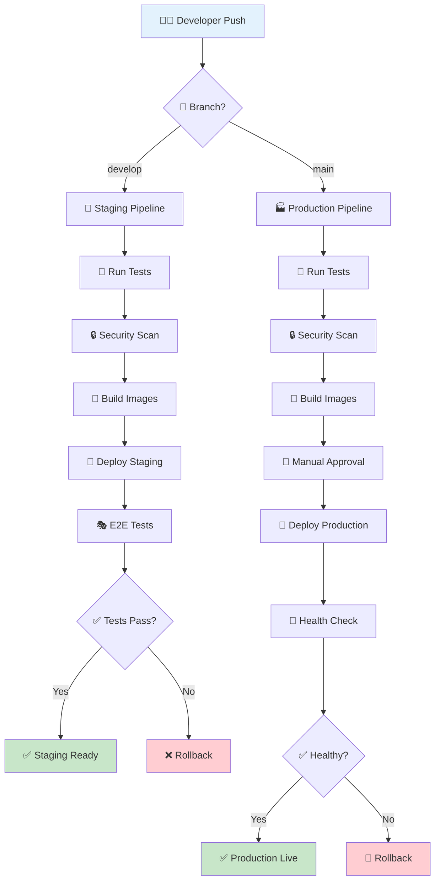
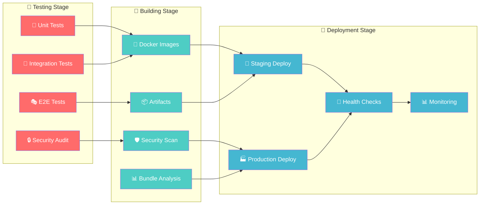
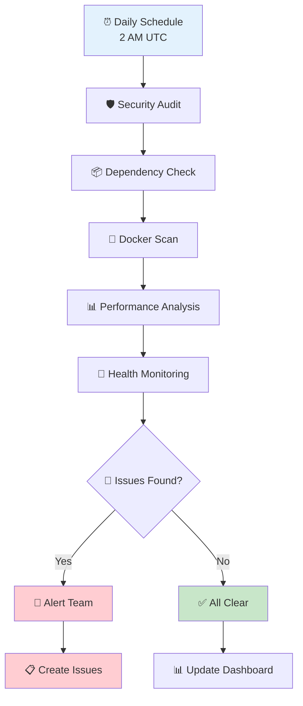

# 🚀 CI/CD Pipeline Setup Guide

> **Complete CI/CD configuration guide for the Vacays Hotel Booking Platform**  
> Automated testing, building, and deployment with GitHub Actions

<div align="center">

[](https://github.com/features/actions)
[](https://github.com/himuexe/Hotel-Booking-Website)
[](https://www.docker.com/)
[](https://github.com/himuexe/Hotel-Booking-Website)

</div>

---

## 📋 Table of Contents

1. [🎯 Overview](#-overview)
2. [📋 Prerequisites](#-prerequisites)
3. [🔧 Workflow Features](#-workflow-features)
4. [⚙️ Setup Instructions](#️-setup-instructions)
5. [🚀 Deployment Options](#-deployment-options)
6. [📊 Monitoring & Alerts](#-monitoring--alerts)
7. [🔧 Troubleshooting](#-troubleshooting)

---

## 🎯 Overview

The project includes two main automated workflows that ensure code quality, security, and reliable deployments:

### 🔄 Complete CI/CD Pipeline Flow



### 🏗️ Pipeline Architecture



<div align="center">

| Workflow | Purpose | Trigger | Status |
|----------|---------|---------|--------|
| **🔄 CI/CD Pipeline** | Testing, Building, Deployment | Push to `main`/`develop` | [](https://github.com/himuexe/Hotel-Booking-Website/actions) |
| **🔒 Security Monitoring** | Security Scans, Health Checks | Daily Schedule | [](https://github.com/himuexe/Hotel-Booking-Website/actions) |

</div>

### 🔒 Security Monitoring Workflow



---

## 📋 Prerequisites

### 🔑 Repository Secrets

Configure the following secrets in your GitHub repository:  
**Settings > Secrets and variables > Actions > Secrets**

| Secret Name | Description | Example |
|-------------|-------------|---------|
| `GITHUB_TOKEN` | Automatically provided by GitHub | *(auto-generated)* |

> 💡 **Note**: Additional secrets may be required for specific deployment targets

### 📊 Repository Variables

Configure the following variables in your GitHub repository:  
**Settings > Secrets and variables > Actions > Variables**

| Variable Name | Description | Example |
|---------------|-------------|---------|
| `PRODUCTION_URL` | Production deployment URL | `https://hotel-booking.yourdomain.com` |
| `STAGING_URL` | Staging deployment URL | `https://staging.hotel-booking.yourdomain.com` |

---

## 🔧 Workflow Features

### 🔄 CI/CD Pipeline

<div align="center">

[](https://github.com/himuexe/Hotel-Booking-Website/blob/main/.github/workflows/ci-cd.yml)

</div>

#### 1. 🧪 Test & Quality Checks
- **🎨 Frontend**: Linting, type checking, unit tests
- **🖥️ Backend**: API tests, security audit
- **🎭 E2E Tests**: Complete user journey validation
- **📦 Artifacts**: Frontend build artifacts stored

#### 2. 🔒 Security Scanning
- **🛡️ Tool**: Trivy vulnerability scanner
- **📁 Scope**: Filesystem scan for vulnerabilities
- **📊 Output**: SARIF format uploaded to GitHub Security tab

#### 3. 🐳 Docker Image Building
- **📦 Registry**: GitHub Container Registry (ghcr.io)
- **🏗️ Images**: Separate images for frontend and backend
- **🌐 Platforms**: linux/amd64, linux/arm64
- **⚡ Caching**: GitHub Actions cache for faster builds

#### 4. 🚀 Deployment
- **🧪 Staging**: Triggered on `develop` branch pushes
- **🏭 Production**: Triggered on `main` branch pushes
- **🔧 Method**: Configurable deployment strategies

#### 5. 🎭 E2E Testing
- **🛠️ Tool**: Playwright
- **⚡ Trigger**: After staging deployment
- **🌐 Environment**: Configurable via `BASE_URL`

### 🔒 Security Monitoring

<div align="center">

[](https://github.com/himuexe/Hotel-Booking-Website/blob/main/.github/workflows/security-monitoring.yml)

</div>

#### 1. 🛡️ Daily Security Audit
- **⏰ Schedule**: Daily at 2 AM UTC
- **📦 Scope**: All npm dependencies
- **📊 Output**: JSON audit results

#### 2. 📈 Dependency Updates Check
- **🔧 Tool**: npm outdated
- **📦 Scope**: All components
- **📊 Output**: Dependency update report

#### 3. 🐳 Docker Security Scanning
- **🛡️ Tool**: Trivy
- **📦 Scope**: Built Docker images
- **📊 Output**: JSON and SARIF formats

#### 4. 📊 Performance Monitoring
- **🔧 Tool**: vite-bundle-analyzer (when available)
- **📦 Scope**: Frontend bundle analysis
- **🔄 Fallback**: Basic bundle size reporting

#### 5. 🏥 Health Monitoring
- **⏰ Frequency**: Daily (production only)
- **🌐 Endpoints**: `/health` on configured URLs
- **📋 Requirements**: `PRODUCTION_URL` and `STAGING_URL` variables

---

## ⚙️ Setup Instructions

### 1. 🔄 Enable Workflows

1. **Fork or clone** the repository
2. **Workflows are automatically enabled** for the repository owner
3. **For forks**: Go to **Actions** tab and enable workflows

### 2. 📊 Configure Repository Variables

1. Navigate to **Settings > Secrets and variables > Actions**
2. Click **Variables** tab
3. Add the following variables:

```bash
# 🏭 Production URL (when deployed)
PRODUCTION_URL=https://your-production-domain.com

# 🧪 Staging URL (when deployed)  
STAGING_URL=https://staging.your-domain.com
```

### 3. 📦 Container Registry Setup

The workflows automatically use GitHub Container Registry (ghcr.io) with the `GITHUB_TOKEN`. **No additional setup required**.

### 4. 🛡️ Environment Protection (Optional)

For production deployments, consider setting up environment protection:

1. Go to **Settings > Environments**
2. Create `production` environment
3. Add protection rules:
   - ✅ **Required reviewers**
   - ⏰ **Wait timer**
   - 🌿 **Deployment branches** (main only)

---

## 🚀 Deployment Options

### 🐳 Docker Compose Deployment

The project includes a deployment script that supports Docker Compose:

```bash
# 🏭 Deploy to production
./scripts/deploy.sh --type docker-compose --env production

# 🧪 Deploy to staging
./scripts/deploy.sh --type docker-compose --env staging
```

### ☸️ Kubernetes Deployment

Basic Kubernetes configurations are provided in the `k8s/` directory:

```bash
# 🚀 Deploy to Kubernetes
./scripts/deploy.sh --type kubernetes --env production --namespace hotel-booking
```

**Required Kubernetes Secrets:**
```bash
kubectl create secret generic hotel-booking-secrets \
  --from-literal=jwt-secret=your-jwt-secret \
  --from-literal=mongodb-connection-string=your-mongodb-url \
  --namespace=hotel-booking
```

---

## 📊 Monitoring & Alerts

### 🔒 Security Monitoring

<div align="center">

| Feature | Tool | Frequency | Output |
|---------|------|-----------|--------|
| **🛡️ Vulnerability Scans** | Trivy | Daily | GitHub Security Tab |
| **📦 Dependency Audits** | npm audit | Daily | JSON Reports |
| **📊 SARIF Upload** | Trivy | Daily | Security Insights |

</div>

### 🏥 Health Monitoring

- **🏭 Production Health**: Daily checks when `PRODUCTION_URL` is configured
- **🧪 Staging Health**: Daily checks when `STAGING_URL` is configured
- **🌐 Endpoints**: Expects `/health` endpoint returning 200 OK

### 📈 Performance Monitoring

- **📦 Bundle Analysis**: Frontend bundle size tracking
- **📁 Build Artifacts**: Stored for 7-30 days depending on type

---

## 🔧 Troubleshooting

### 🚨 Common Issues & Solutions

#### 📦 Missing Bundle Analyzer

**Problem**: Bundle analyzer not found

**Solution**:
```bash
# Install the analyzer
cd frontend && npm install --save-dev vite-bundle-analyzer
```
> 💡 The workflow includes fallback bundle size reporting

#### 🏥 Health Check Failures

**Problem**: Health checks failing

**Solutions**:
- ✅ Ensure `/health` endpoint exists and returns 200 OK
- ✅ Verify `PRODUCTION_URL` and `STAGING_URL` variables are correct
- ✅ Check network connectivity to deployment URLs

#### 🐳 Docker Build Failures

**Problem**: Docker builds failing

**Solutions**:
- ✅ Check Dockerfile syntax
- ✅ Verify all dependencies are properly installed
- ✅ Review build logs in Actions tab
- ✅ Check for missing environment variables

#### 🧪 Test Failures

**Problem**: Tests failing in CI/CD

**Solutions**:
- ✅ Ensure all test scripts exist in package.json
- ✅ Check test dependencies are installed
- ✅ Review test output in Actions tab
- ✅ Verify test environment configuration

### 🔍 Debugging Workflows

```bash
# 📊 Check workflow status
gh workflow list

# 📋 View workflow runs
gh run list

# 🔍 View specific run details
gh run view <run-id>

# 📥 Download artifacts
gh run download <run-id>
```

### 🆘 Getting Help

If you encounter CI/CD issues:

1. **📋 Check the Actions tab** for detailed logs
2. **🔍 Review workflow files** in `.github/workflows/`
3. **📊 Verify environment variables** and secrets
4. **🐛 Create an issue** with:
   - Workflow run URL
   - Error messages from logs
   - Environment details
   - Steps to reproduce

---

<div align="center">

**🚀 Automated CI/CD ensures reliable, consistent deployments!**

**Questions?** [Create an issue](https://github.com/himuexe/Hotel-Booking-Website/issues) | **Contribute** [Submit a PR](https://github.com/himuexe/Hotel-Booking-Website/pulls)

[🔝 Back to Top](#-cicd-pipeline-setup-guide)

</div> 