# 🧪 Vacays App Testing Documentation

> **Comprehensive testing guide for the Vacays Hotel Booking Platform**  
> Covering unit tests, integration tests, end-to-end tests, and performance testing

<div align="center">

[](https://github.com/himuexe/Hotel-Booking-Website)
[](https://jestjs.io/)
[](https://playwright.dev/)
[](https://github.com/himuexe/Hotel-Booking-Website)

</div>

---

## 📋 Table of Contents

1. [🎯 Testing Strategy](#-testing-strategy)
2. [🛠️ Testing Tools](#️-testing-tools)
3. [🔬 Unit Testing](#-unit-testing)
4. [🔗 Integration Testing](#-integration-testing)
5. [🎭 End-to-End Testing](#-end-to-end-testing)
6. [♿ Accessibility Testing](#-accessibility-testing)
7. [⚡ Performance Testing](#-performance-testing)
8. [🚀 Running Tests](#-running-tests)

---

## 🎯 Testing Strategy

The Vacays App follows a comprehensive testing pyramid strategy that ensures reliability and maintainability:

### 🏗️ Testing Pyramid

```mermaid
graph TD
    subgraph "🎭 E2E Tests (10%)"
        E1[🛒 Complete Booking Flow]
        E2[🏨 Hotel Management]
        E3[🔐 Authentication Journey]
    end
    
    subgraph "🔗 Integration Tests (20%)"
        I1[🌐 API Endpoints]
        I2[🗄️ Database Operations]
        I3[🔄 Component Interactions]
    end
    
    subgraph "🔬 Unit Tests (70%)"
        U1[⚛️ React Components]
        U2[🎣 Custom Hooks]
        U3[🛠️ Utility Functions]
        U4[📊 Business Logic]
    end
    
    E1 --> I1
    E2 --> I2
    E3 --> I3
    I1 --> U1
    I2 --> U2
    I3 --> U3
    I3 --> U4
    
    style E1 fill:#ff6b6b,color:#fff
    style E2 fill:#ff6b6b,color:#fff
    style E3 fill:#ff6b6b,color:#fff
    style I1 fill:#4ecdc4,color:#fff
    style I2 fill:#4ecdc4,color:#fff
    style I3 fill:#4ecdc4,color:#fff
    style U1 fill:#45b7d1,color:#fff
    style U2 fill:#45b7d1,color:#fff
    style U3 fill:#45b7d1,color:#fff
    style U4 fill:#45b7d1,color:#fff
```



### 📊 Testing Levels

| Level | Purpose | Tools | Coverage |
|-------|---------|-------|----------|
| **🔬 Unit Tests** | Test individual components and functions in isolation | Jest, React Testing Library | ~70% |
| **🔗 Integration Tests** | Test interactions between components and services | Jest, Supertest | ~20% |
| **🎭 E2E Tests** | Test complete user flows from start to finish | Playwright | ~10% |
| **♿ Accessibility Tests** | Ensure application is accessible to all users | Lighthouse, axe-core | Ongoing |
| **⚡ Performance Tests** | Validate application performance under load | Lighthouse, K6 | Ongoing |

### 🔄 Testing Workflow

```mermaid
flowchart LR
    A[👨‍💻 Code Changes] --> B[🔬 Unit Tests]
    B --> C{✅ Pass?}
    C -->|Yes| D[🔗 Integration Tests]
    C -->|No| E[🐛 Fix & Retry]
    E --> B
    D --> F{✅ Pass?}
    F -->|Yes| G[🎭 E2E Tests]
    F -->|No| E
    G --> H{✅ Pass?}
    H -->|Yes| I[♿ Accessibility Tests]
    H -->|No| E
    I --> J{✅ Pass?}
    J -->|Yes| K[⚡ Performance Tests]
    J -->|No| E
    K --> L{✅ Pass?}
    L -->|Yes| M[🚀 Deploy]
    L -->|No| E
    
    style A fill:#e3f2fd
    style M fill:#c8e6c9
    style E fill:#ffcdd2
```



---

## 🛠️ Testing Tools

<div align="center">

### Frontend Testing
[](https://jestjs.io/)
[](https://testing-library.com/docs/react-testing-library/intro/)
[](https://vitest.dev/)

### Backend Testing
[](https://jestjs.io/)
[](https://github.com/visionmedia/supertest)
[](https://github.com/nodkz/mongodb-memory-server)

### E2E Testing
[](https://playwright.dev/)

### Quality & Performance
[](https://developers.google.com/web/tools/lighthouse)
[](https://github.com/dequelabs/axe-core)

</div>

---

## 🔬 Unit Testing

> **Focus**: Testing individual React components, hooks, and utility functions in isolation

### 🎨 Frontend Unit Tests

#### Component Tests

Component tests verify that components render correctly with different props and respond appropriately to user interactions.

**Example: HotelCard Component Test**

```typescript
// HotelCard.test.tsx
import { render, screen } from '@testing-library/react';
import userEvent from '@testing-library/user-event';
import { BrowserRouter } from 'react-router-dom';
import HotelCard from '../components/HotelCard';

const mockHotel = {
  _id: '1',
  name: 'Test Hotel',
  city: 'Test City',
  country: 'Test Country',
  description: 'Test Description',
  type: 'Budget',
  adultCount: 2,
  childCount: 1,
  facilities: ['Wifi', 'Parking'],
  pricePerNight: 100,
  starRating: 4,
  imageUrls: ['test.jpg'],
  lastUpdated: new Date(),
};

describe('HotelCard', () => {
  test('renders hotel information correctly', () => {
    render(
      <BrowserRouter>
        <HotelCard hotel={mockHotel} />
      </BrowserRouter>
    );

    expect(screen.getByText('Test Hotel')).toBeInTheDocument();
    expect(screen.getByText('Test City, Test Country')).toBeInTheDocument();
    expect(screen.getByText('$100 per night')).toBeInTheDocument();
    expect(screen.getByText('★★★★☆')).toBeInTheDocument();
  });

  test('navigates to hotel details page when clicked', async () => {
    render(
      <BrowserRouter>
        <HotelCard hotel={mockHotel} />
      </BrowserRouter>
    );

    const viewDetailsButton = screen.getByText('View Details');
    await userEvent.click(viewDetailsButton);
    
    // Check if navigated to the correct URL
    // In a more complete test, you'd use a mock router to verify navigation
  });
});
```

#### Hook Tests

Hook tests verify custom React hooks work as expected.

**Example: useAuth Hook Test**

```typescript
// useAuth.test.tsx
import { renderHook, act } from '@testing-library/react-hooks';
import { useAuth } from '../hooks/useAuth';
import { AuthProvider } from '../contexts/AuthContext';

jest.mock('../api', () => ({
  loginUser: jest.fn().mockResolvedValue({ token: 'test-token', firstName: 'Test' }),
  registerUser: jest.fn().mockResolvedValue({ token: 'test-token', firstName: 'Test' }),
  logoutUser: jest.fn().mockResolvedValue({}),
}));

describe('useAuth', () => {
  test('login updates auth state correctly', async () => {
    const wrapper = ({ children }) => <AuthProvider>{children}</AuthProvider>;
    const { result } = renderHook(() => useAuth(), { wrapper });

    await act(async () => {
      await result.current.login({ email: 'test@example.com', password: 'password' });
    });

    expect(result.current.isLoggedIn).toBe(true);
    expect(result.current.userInfo).toEqual({ firstName: 'Test' });
  });

  // Additional tests for register, logout, etc.
});
```

#### Utility Function Tests

Tests for utility functions verify they produce the expected outputs for given inputs.

**Example: Date Formatting Utility Test**

```typescript
// formatDate.test.ts
import { formatDate } from '../utils/formatDate';

describe('formatDate', () => {
  test('formats date correctly', () => {
    const date = new Date('2023-01-15T12:00:00Z');
    expect(formatDate(date)).toBe('January 15, 2023');
  });

  test('handles invalid date', () => {
    expect(formatDate(null)).toBe('Invalid Date');
    expect(formatDate(undefined)).toBe('Invalid Date');
  });
});
```

### 🖥️ Backend Unit Tests

> **Focus**: Testing individual functions, models, and utilities

#### Model Tests

Model tests verify that MongoDB models behave as expected.

**Example: User Model Test**

```typescript
// UserModel.test.ts
import mongoose from 'mongoose';
import { MongoMemoryServer } from 'mongodb-memory-server';
import User from '../models/User';

let mongoServer: MongoMemoryServer;

beforeAll(async () => {
  mongoServer = await MongoMemoryServer.create();
  await mongoose.connect(mongoServer.getUri());
});

afterAll(async () => {
  await mongoose.disconnect();
  await mongoServer.stop();
});

describe('User Model', () => {
  test('create & save user successfully', async () => {
    const userData = {
      firstName: 'Test',
      lastName: 'User',
      email: 'test@example.com',
      password: 'Password123!'
    };
    
    const validUser = new User(userData);
    const savedUser = await validUser.save();
    
    expect(savedUser._id).toBeDefined();
    expect(savedUser.firstName).toBe(userData.firstName);
    expect(savedUser.lastName).toBe(userData.lastName);
    expect(savedUser.email).toBe(userData.email);
    // Password should be hashed
    expect(savedUser.password).not.toBe(userData.password);
  });
  
  // Additional tests for validation, methods, etc.
});
```

#### Route Handler Tests

Route handler tests verify that API endpoints behave as expected.

**Example: Auth Routes Test**

```typescript
// authRoutes.test.ts
import request from 'supertest';
import express from 'express';
import mongoose from 'mongoose';
import { MongoMemoryServer } from 'mongodb-memory-server';
import authRoutes from '../routes/auth';
import User from '../models/User';

let app: express.Application;
let mongoServer: MongoMemoryServer;

beforeAll(async () => {
  mongoServer = await MongoMemoryServer.create();
  await mongoose.connect(mongoServer.getUri());
  
  app = express();
  app.use(express.json());
  app.use('/api/auth', authRoutes);
});

afterAll(async () => {
  await mongoose.disconnect();
  await mongoServer.stop();
});

describe('Auth Routes', () => {
  beforeEach(async () => {
    await User.deleteMany({});
  });
  
  test('register user successfully', async () => {
    const res = await request(app)
      .post('/api/auth/register')
      .send({
        firstName: 'Test',
        lastName: 'User',
        email: 'test@example.com',
        password: 'Password123!'
      });
    
    expect(res.status).toBe(201);
    expect(res.body).toHaveProperty('token');
    expect(res.body).toHaveProperty('firstName', 'Test');
  });
  
  // Additional tests for login, logout, etc.
});
```

---

## 🔗 Integration Testing

> **Focus**: Verifying that different parts of the application work together correctly

### 🌐 API Integration Tests

API integration tests verify that the API endpoints correctly interact with the database and other services.

**Example: Booking API Integration Test**

```typescript
// bookingAPI.test.ts
import request from 'supertest';
import express from 'express';
import mongoose from 'mongoose';
import { MongoMemoryServer } from 'mongodb-memory-server';
import bookingRoutes from '../routes/booking';
import authMiddleware from '../middleware/auth';
import User from '../models/User';
import Hotel from '../models/Hotel';
import Booking from '../models/Booking';

let app: express.Application;
let mongoServer: MongoMemoryServer;
let authToken: string;
let userId: string;
let hotelId: string;

beforeAll(async () => {
  mongoServer = await MongoMemoryServer.create();
  await mongoose.connect(mongoServer.getUri());
  
  app = express();
  app.use(express.json());
  app.use(authMiddleware);
  app.use('/api/bookings', bookingRoutes);
  
  // Create test user
  const user = await User.create({
    firstName: 'Test',
    lastName: 'User',
    email: 'test@example.com',
    password: 'Password123!'
  });
  userId = user._id.toString();
  
  // Create test hotel
  const hotel = await Hotel.create({
    name: 'Test Hotel',
    city: 'Test City',
    country: 'Test Country',
    description: 'Test Description',
    type: 'Budget',
    adultCount: 2,
    childCount: 1,
    facilities: ['Wifi', 'Parking'],
    pricePerNight: 100,
    starRating: 4,
    imageUrls: ['test.jpg'],
    lastUpdated: new Date(),
  });
  hotelId = hotel._id.toString();
  
  // Generate auth token
  authToken = 'Bearer ' + generateToken(userId);
});

afterAll(async () => {
  await mongoose.disconnect();
  await mongoServer.stop();
});

describe('Booking API', () => {
  beforeEach(async () => {
    await Booking.deleteMany({});
  });
  
  test('create booking successfully', async () => {
    const res = await request(app)
      .post('/api/bookings')
      .set('Authorization', authToken)
      .send({
        hotelId,
        checkIn: '2023-12-01',
        checkOut: '2023-12-05',
        adultCount: 2,
        childCount: 1,
        totalCost: 400
      });
    
    expect(res.status).toBe(201);
    expect(res.body).toHaveProperty('_id');
    expect(res.body.hotel).toBe(hotelId);
    expect(res.body.user).toBe(userId);
  });
  
  // Additional tests for other booking endpoints
});
```

---

## 🎭 End-to-End Testing

> **Focus**: Testing complete user flows from start to finish using Playwright

### 🔐 Authentication Flow Tests

**Example: User Registration & Login E2E Test**

```typescript
// auth.spec.ts
import { test, expect } from '@playwright/test';

test.describe('🔐 Authentication Flow', () => {
  test('should allow user to register successfully', async ({ page }) => {
    await page.goto('/register');
    
    // Fill in registration form
    await page.fill('input[name="firstName"]', 'Test');
    await page.fill('input[name="lastName"]', 'User');
    await page.fill('input[name="email"]', `test${Date.now()}@example.com`);
    await page.fill('input[name="password"]', 'Password123!');
    await page.fill('input[name="confirmPassword"]', 'Password123!');
    
    // Submit form
    await page.click('button[type="submit"]');
    
    // Check if redirected to home page
    await expect(page).toHaveURL('/');
    
    // Check if user is logged in
    await expect(page.locator('text=My Bookings')).toBeVisible();
    await expect(page.locator('text=My Account')).toBeVisible();
  });
  
  test('should allow user to login successfully', async ({ page }) => {
    await page.goto('/login');
    
    // Fill in login form
    await page.fill('input[name="email"]', 'test@example.com');
    await page.fill('input[name="password"]', 'Password123!');
    
    // Submit form
    await page.click('button[type="submit"]');
    
    // Check if redirected to home page
    await expect(page).toHaveURL('/');
    
    // Check if user is logged in
    await expect(page.locator('text=My Bookings')).toBeVisible();
    await expect(page.locator('text=My Account')).toBeVisible();
  });
});
```

### 🏨 Hotel Booking Flow Tests

```typescript
// booking.spec.ts
import { test, expect } from '@playwright/test';

test.describe('🏨 Hotel Booking Flow', () => {
  test('should complete full booking process', async ({ page }) => {
    // Login first
    await page.goto('/login');
    await page.fill('input[name="email"]', 'test@example.com');
    await page.fill('input[name="password"]', 'Password123!');
    await page.click('button[type="submit"]');
    
    // Search for hotels
    await page.goto('/');
    await page.fill('input[name="destination"]', 'New York');
    await page.fill('input[name="checkIn"]', '2024-12-01');
    await page.fill('input[name="checkOut"]', '2024-12-05');
    await page.click('button[type="submit"]');
    
    // Select a hotel
    await page.click('.hotel-card:first-child .view-details-btn');
    
    // Book the hotel
    await page.click('button:has-text("Book Now")');
    
    // Fill booking form
    await page.fill('input[name="firstName"]', 'Test');
    await page.fill('input[name="lastName"]', 'User');
    await page.fill('input[name="email"]', 'test@example.com');
    
    // Complete payment (mock)
    await page.click('button:has-text("Complete Booking")');
    
    // Verify booking confirmation
    await expect(page.locator('text=Booking Confirmed')).toBeVisible();
  });
});
```

### 🚀 Running E2E Tests

```bash
# 🎭 Run all E2E tests
npm run test

# 🖥️ Run in UI mode for debugging
npm run test:ui

# 🎯 Run specific test file
npm run test -- auth.spec.ts

# 🌐 Run on specific browser
npm run test -- --project=chromium
npm run test -- --project=firefox
npm run test -- --project=webkit
```

---

## ♿ Accessibility Testing

> **Focus**: Ensuring the application is accessible to all users following WCAG 2.1 guidelines

### 🔍 Automated Accessibility Tests

```typescript
// accessibility.spec.ts
import { test, expect } from '@playwright/test';
import AxeBuilder from '@axe-core/playwright';

test.describe('♿ Accessibility Compliance', () => {
  test('home page should not have accessibility violations', async ({ page }) => {
    await page.goto('/');
    
    const accessibilityScanResults = await new AxeBuilder({ page }).analyze();
    expect(accessibilityScanResults.violations).toEqual([]);
  });
  
  test('hotel details page should not have accessibility violations', async ({ page }) => {
    await page.goto('/hotel/1');
    
    const accessibilityScanResults = await new AxeBuilder({ page }).analyze();
    expect(accessibilityScanResults.violations).toEqual([]);
  });
  
  test('booking form should be keyboard navigable', async ({ page }) => {
    await page.goto('/hotel/1');
    await page.click('button:has-text("Book Now")');
    
    // Test keyboard navigation
    await page.keyboard.press('Tab');
    await page.keyboard.press('Tab');
    await page.keyboard.press('Enter');
    
    // Verify form interaction works with keyboard
    await expect(page.locator('input[name="firstName"]:focus')).toBeVisible();
  });
});
```

### 📋 Accessibility Checklist

- ✅ **Color Contrast**: Minimum 4.5:1 ratio for normal text
- ✅ **Keyboard Navigation**: All interactive elements accessible via keyboard
- ✅ **Screen Reader Support**: Proper ARIA labels and semantic HTML
- ✅ **Focus Management**: Clear focus indicators and logical tab order
- ✅ **Alternative Text**: Images have descriptive alt text
- ✅ **Form Labels**: All form inputs have associated labels

---

## ⚡ Performance Testing

> **Focus**: Validating application performance under various conditions

### 🚀 Load Testing with K6

```javascript
// load-test.js
import http from 'k6/http';
import { sleep, check } from 'k6';

export const options = {
  stages: [
    { duration: '2m', target: 100 }, // Ramp up to 100 users
    { duration: '5m', target: 100 }, // Stay at 100 users
    { duration: '2m', target: 200 }, // Ramp up to 200 users
    { duration: '5m', target: 200 }, // Stay at 200 users
    { duration: '2m', target: 0 },   // Ramp down to 0 users
  ],
  thresholds: {
    http_req_duration: ['p(99)<1500'], // 99% of requests must complete below 1.5s
    http_req_failed: ['rate<0.1'],     // Error rate must be below 10%
  },
};

export default function () {
  // Test hotel search endpoint
  const searchRes = http.get('http://localhost:7000/api/hotels/search?destination=New York');
  check(searchRes, {
    'search status is 200': (r) => r.status === 200,
    'search response time < 500ms': (r) => r.timings.duration < 500,
  });
  
  // Test hotel details endpoint
  const detailsRes = http.get('http://localhost:7000/api/hotels/1');
  check(detailsRes, {
    'details status is 200': (r) => r.status === 200,
    'details response time < 300ms': (r) => r.timings.duration < 300,
  });
  
  sleep(1);
}
```

### 📊 Frontend Performance Testing

```typescript
// performance.spec.ts
import { test, expect } from '@playwright/test';

test.describe('⚡ Performance Metrics', () => {
  test('home page should load within performance budget', async ({ page }) => {
    await page.goto('/');
    
    // Measure Core Web Vitals
    const metrics = await page.evaluate(() => {
      return new Promise((resolve) => {
        new PerformanceObserver((list) => {
          const entries = list.getEntries();
          resolve(entries);
        }).observe({ entryTypes: ['navigation', 'paint'] });
      });
    });
    
    // Assert performance thresholds
    expect(metrics.find(m => m.name === 'first-contentful-paint')?.duration).toBeLessThan(2000);
  });
});
```

### 🎯 Performance Targets

| Metric | Target | Tool |
|--------|--------|------|
| **First Contentful Paint** | < 2s | Lighthouse |
| **Largest Contentful Paint** | < 2.5s | Lighthouse |
| **Time to Interactive** | < 3s | Lighthouse |
| **API Response Time** | < 500ms | K6 |
| **Database Query Time** | < 100ms | Custom monitoring |

---

## �� Running Tests

### 🔄 Test Execution Flow

```mermaid
flowchart TD
    A[🚀 Start Testing] --> B{🎯 Test Type?}
    B -->|Unit| C[🔬 Unit Tests]
    B -->|Integration| D[🔗 Integration Tests]
    B -->|E2E| E[🎭 E2E Tests]
    B -->|All| F[🧪 Full Test Suite]
    
    C --> C1[⚛️ Frontend Components]
    C --> C2[🎣 React Hooks]
    C --> C3[🛠️ Utility Functions]
    C --> C4[🖥️ Backend APIs]
    
    D --> D1[🌐 API Endpoints]
    D --> D2[🗄️ Database Operations]
    D --> D3[🔄 Service Integration]
    
    E --> E1[🔐 Authentication Flow]
    E --> E2[🛒 Booking Journey]
    E --> E3[🏨 Hotel Management]
    
    F --> C
    F --> D
    F --> E
    
    C1 --> G[📊 Generate Coverage]
    C2 --> G
    C3 --> G
    C4 --> G
    D1 --> G
    D2 --> G
    D3 --> G
    E1 --> H[📋 Test Report]
    E2 --> H
    E3 --> H
    
    G --> I{✅ Coverage > 80%?}
    I -->|Yes| J[✅ Tests Passed]
    I -->|No| K[❌ Improve Coverage]
    H --> L{✅ All E2E Pass?}
    L -->|Yes| J
    L -->|No| M[🐛 Fix E2E Issues]
    
    style A fill:#e3f2fd
    style J fill:#c8e6c9
    style K fill:#ffcdd2
    style M fill:#ffcdd2
```



### 📊 Test Coverage

The Vacays App maintains high test coverage with the following targets:

<div align="center">

| Test Type | Coverage Target | Current Status |
|-----------|----------------|----------------|
| **🔬 Unit Tests** | > 80% | [](https://github.com/himuexe/Hotel-Booking-Website) |
| **🔗 Integration Tests** | > 70% | [](https://github.com/himuexe/Hotel-Booking-Website) |
| **🭠E2E Tests** | All Critical Flows | [](https://github.com/himuexe/Hotel-Booking-Website) |

</div>

### 🧪 Running All Tests

```bash
# 🔬 Frontend unit tests
cd frontend
npm run test
npm run test:coverage

# 🖥️ Backend unit tests  
cd backend
npm run test
npm run test:coverage

# 🎭 E2E tests
cd e2e-tests
npm run test

# 🚀 Run all tests (from root)
npm run test:all
```

### 🔄 Continuous Integration

```mermaid
flowchart LR
    A[📝 Code Push] --> B[🔄 GitHub Actions]
    B --> C[🏗️ Build Environment]
    C --> D[📦 Install Dependencies]
    D --> E[🔬 Unit Tests]
    E --> F{✅ Pass?}
    F -->|No| G[❌ Build Failed]
    F -->|Yes| H[🔗 Integration Tests]
    H --> I{✅ Pass?}
    I -->|No| G
    I -->|Yes| J[🎭 E2E Tests]
    J --> K{✅ Pass?}
    K -->|No| G
    K -->|Yes| L[♿ Accessibility Tests]
    L --> M{✅ Pass?}
    M -->|No| G
    M -->|Yes| N[⚡ Performance Tests]
    N --> O{✅ Pass?}
    O -->|No| G
    O -->|Yes| P[🚀 Deploy]
    
    G --> Q[📧 Notify Team]
    P --> R[✅ Success]
    
    style A fill:#e3f2fd
    style R fill:#c8e6c9
    style G fill:#ffcdd2
    style Q fill:#ffcdd2
```



Tests are automatically executed in our CI/CD pipeline:

```yaml
# .github/workflows/ci-cd.yml
- name: 🧪 Run Frontend Tests
  run: |
    cd frontend
    npm run test:coverage
    
- name: 🧪 Run Backend Tests  
  run: |
    cd backend
    npm run test:coverage
    
- name: 🎭 Run E2E Tests
  run: |
    cd e2e-tests
    npm run test
```

### 📈 Test Data Management

#### 🗄️ Test Database Strategy

- **Unit/Integration Tests**: MongoDB Memory Server (isolated)
- **E2E Tests**: Dedicated test database (reset between runs)
- **Performance Tests**: Production-like dataset

```typescript
// Test database setup
beforeAll(async () => {
  mongoServer = await MongoMemoryServer.create();
  await mongoose.connect(mongoServer.getUri());
});

afterAll(async () => {
  await mongoose.disconnect();
  await mongoServer.stop();
});
```

---

## 🎯 Test Best Practices

### ✅ Testing Guidelines

1. **🔒 Isolation**: Tests should be independent and not rely on state from other tests
2. **📖 Readability**: Test names should clearly describe what they're testing
3. **🔧 Maintainability**: Tests should be easy to maintain and update
4. **⚡ Speed**: Tests should run quickly to encourage frequent testing
5. **🎯 Reliability**: Tests should be deterministic and not produce flaky results

### 🚨 Common Anti-Patterns to Avoid

- ❌ **Testing Implementation Details**: Focus on behavior, not internal structure
- ❌ **Overly Complex Tests**: Keep tests simple and focused
- ❌ **Shared Test State**: Each test should set up its own data
- ❌ **Testing Third-Party Libraries**: Mock external dependencies
- ❌ **Brittle Selectors**: Use stable, semantic selectors in E2E tests

---

## 🔧 Troubleshooting

### 🚨 Common Test Issues & Solutions

#### 🎭 Flaky E2E Tests

**Problem**: Tests that pass and fail inconsistently

**Solutions**:
```typescript
// ✅ Add explicit waits
await page.waitForSelector('[data-testid="hotel-list"]');

// ✅ Use retry logic
test.describe.configure({ retries: 2 });

// ✅ Improve test isolation
test.beforeEach(async ({ page }) => {
  await page.goto('/');
  await page.evaluate(() => localStorage.clear());
});
```

#### 🐌 Slow Test Execution

**Problem**: Tests take too long to run

**Solutions**:
```typescript
// ✅ Mock external dependencies
jest.mock('../services/stripe', () => ({
  createPaymentIntent: jest.fn().mockResolvedValue({ id: 'pi_test' })
}));

// ✅ Use test parallelization
// In package.json
"test": "jest --maxWorkers=4"
```

#### 🔌 Database Connection Issues

**Problem**: Tests fail due to database connectivity

**Solutions**:
```typescript
// ✅ Use MongoDB Memory Server
import { MongoMemoryServer } from 'mongodb-memory-server';

// ✅ Proper cleanup
afterEach(async () => {
  await User.deleteMany({});
  await Hotel.deleteMany({});
});
```

#### 🔐 Authentication Issues in Tests

**Problem**: Tests fail due to authentication requirements

**Solutions**:
```typescript
// ✅ Create test-specific auth tokens
const testToken = jwt.sign({ userId: 'test-user' }, process.env.JWT_SECRET);

// ✅ Mock authentication middleware
jest.mock('../middleware/auth', () => (req, res, next) => {
  req.userId = 'test-user';
  next();
});
```

### 🆘 Getting Help

If you encounter testing issues:

1. **📋 Check test logs** for detailed error messages
2. **🔍 Verify test environment** setup and dependencies
3. **📊 Run tests in isolation** to identify problematic tests
4. **🐛 Create an issue** with:
   - Test failure logs
   - Environment details
   - Steps to reproduce

---

<div align="center">

**🧪 Comprehensive testing ensures reliable, high-quality software!**

**Questions?** [Create an issue](https://github.com/himuexe/Hotel-Booking-Website/issues) | **Contribute** [Submit a PR](https://github.com/himuexe/Hotel-Booking-Website/pulls)

[🔝 Back to Top](#-vacays-app-testing-documentation)

</div> 